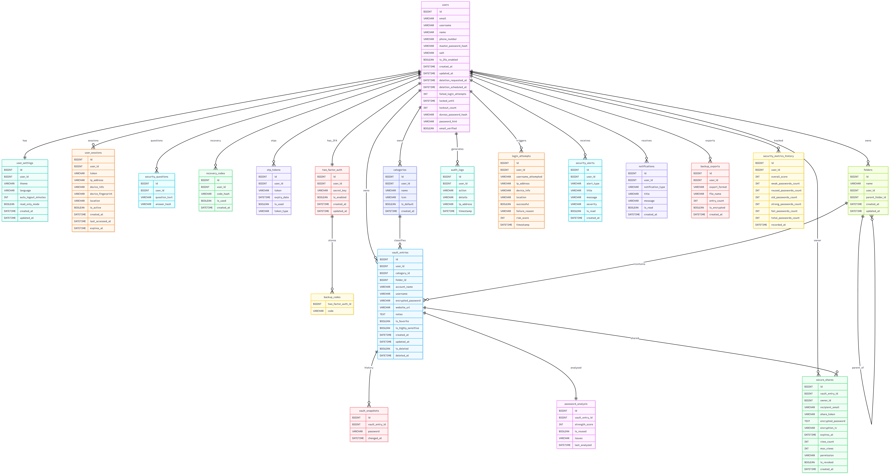

# 🔐 Rev Password Manager

A full-stack, enterprise-grade password manager built with **Angular 18** (frontend) and **Spring Boot 3** (backend). It provides end-to-end encrypted vault storage, multi-factor authentication, real-time breach monitoring, and secure credential sharing.

---

## 📋 Table of Contents

- [Features](#-features)
- [Tech Stack](#-tech-stack)
- [Architecture Overview](#-architecture-overview)
- [Project Structure](#-project-structure)
- [Prerequisites](#-prerequisites)
- [Installation & Setup](#-installation--setup)
  - [Option 1: Docker (Recommended)](#option-1-docker-recommended)
  - [Option 2: Manual Setup](#option-2-manual-setup)
- [Environment Variables](#-environment-variables)
- [API Documentation](#-api-documentation)
- [Database ER Diagram](#-database-er-diagram)
- [Running Tests](#-running-tests)

---

## ✨ Features

| Feature | Description |
|---|---|
| 🔒 **Encrypted Vault** | Store passwords, URLs, and notes — encrypted with AES-256-GCM at rest |
| 📁 **Folders & Categories** | Organise entries into nested folders and custom categories |
| 🔑 **Password Generator** | Generate strong passwords with configurable rules |
| 📊 **Security Dashboard** | Overall security score, weak/reused/old password stats |
| 🛡️ **Breach Monitor** | HaveIBeenPwned integration scans your vault for compromised passwords |
| 🔐 **Two-Factor Auth (2FA)** | TOTP-based 2FA with QR code setup and backup recovery codes |
| 📱 **Session Management** | View, monitor, and remotely revoke active sessions |
| 📜 **Audit Log** | Full history of every account action with IP and timestamp |
| 🔗 **Secure Sharing** | Share passwords via time-limited, view-limited encrypted links |
| 💾 **Backup & Restore** | Export/import vault data in JSON or CSV format |
| 🚨 **Security Questions** | Account recovery via hashed security question answers |
| 🌗 **Themes** | Light, dark, and system-default UI themes |
| ⚡ **Rate Limiting** | Per-IP request throttling on all auth endpoints |
| 🤖 **Captcha** | Google reCAPTCHA on login and registration |

---

## 🛠️ Tech Stack

### Backend
| Technology | Version | Purpose |
|---|---|---|
| Java | 21 | Language |
| Spring Boot | 3.2.3 | Application framework |
| Spring Security | 6.x | Authentication & authorisation |
| Spring Data JPA | 3.x | ORM / database access |
| Spring Mail | 3.x | Email (OTP, alerts) |
| MySQL | 8.0 | Relational database |
| JJWT | 0.12.5 | JWT access & refresh tokens |
| TOTP library | 1.7.1 | Time-based OTP (2FA) |
| Lombok | 1.18.30 | Boilerplate reduction |
| MapStruct | 1.5.5 | DTO ↔ entity mapping |
| SpringDoc OpenAPI | 2.3.0 | Swagger UI / API docs |
| JaCoCo | 0.8.11 | Code coverage |
| Testcontainers | 1.19.5 | Integration test DB |

### Frontend
| Technology | Version | Purpose |
|---|---|---|
| Angular | 18.2 | SPA framework |
| Angular Material | 18.2 | UI component library |
| Lucide Angular | 0.487 | Icon set |
| angularx-qrcode | 18.0 | QR code for 2FA setup |
| ng-recaptcha | 13.2 | Google reCAPTCHA |
| RxJS | 7.8 | Reactive streams |
| TypeScript | 5.5 | Language |
| Karma + Jasmine | 6.4 / 5.2 | Unit testing |

### Infrastructure
| Technology | Purpose |
|---|---|
| Docker + Docker Compose | Containerised deployment |
| Nginx | Frontend web server (in Docker) |

---

## 🏗️ Architecture Overview

```
┌──────────────────────────────────┐
│  Browser (Angular 18 SPA)        │
│  Route Guards → HTTP Interceptors│
│  → Angular Services → Components │
└──────────────┬───────────────────┘
               │ HTTPS + JWT
┌──────────────▼───────────────────┐
│  Spring Boot 3 Backend           │
│  Rate Limit → JWT Filter         │
│  → REST Controllers              │
│  → Business Services             │
│  → Spring Data JPA Repositories  │
└──────┬────────────────┬──────────┘
       │                │
┌──────▼──────┐  ┌──────▼──────────┐
│  MySQL 8.0  │  │ External APIs    │
│  Database   │  │ HaveIBeenPwned   │
│             │  │ SMTP Email       │
└─────────────┘  └─────────────────┘
```

---

## 📁 Project Structure

```
Rev-PasswordManager/
│
├── frontend/                          # Angular 18 SPA
│   └── src/
│       └── app/
│           ├── core/                  # Singleton services & infrastructure
│           │   ├── guards/            # authGuard, guestGuard
│           │   ├── interceptors/      # JWT attach, error handling, loading
│           │   ├── services/          # auth, theme, notification, session
│           │   └── models/            # TypeScript interfaces
│           ├── features/              # Page-level feature modules
│           │   ├── auth/              # Login, Register (4-step), Forgot Password
│           │   ├── vault/             # Password vault CRUD + timeline
│           │   ├── dashboard/         # Security score, charts, breach alerts
│           │   ├── user-profile/      # Settings: account, security, sessions, audit
│           │   ├── backup/            # Export & import vault data
│           │   └── secure-sharing/    # Create & access shareable password links
│           ├── layout/                # App shell: sidebar + header
│           └── shared/                # Reusable components (custom-select, etc.)
│
├── src/
│   └── main/java/com/revature/passwordmanager/
│       ├── controller/                # 15 REST controllers
│       ├── service/                   # Business logic (auth, vault, security, ...)
│       │   ├── auth/
│       │   ├── vault/
│       │   ├── security/
│       │   ├── backup/
│       │   ├── sharing/
│       │   ├── notification/
│       │   ├── email/
│       │   ├── user/
│       │   ├── dashboard/
│       │   └── analytics/
│       ├── model/                     # JPA entities (17 entities, 7 packages)
│       │   ├── user/                  # User, UserSettings, UserSession, ...
│       │   ├── vault/                 # VaultEntry, Category, Folder, VaultSnapshot
│       │   ├── auth/                  # OtpToken, TwoFactorAuth
│       │   ├── security/              # AuditLog, LoginAttempt, PasswordAnalysis, SecurityAlert
│       │   ├── sharing/               # SecureShare
│       │   ├── notification/          # Notification
│       │   └── backup/                # BackupExport
│       ├── repository/                # Spring Data JPA repositories
│       ├── security/                  # JWT filter, rate limiter, user details service
│       ├── config/                    # CORS, JWT, encryption, OpenAPI, security config
│       ├── dto/                       # Request & response DTOs
│       ├── exception/                 # Global exception handler
│       ├── scheduler/                 # Scheduled tasks (breach scan, session cleanup)
│       ├── aspect/                    # AOP: audit logging, method logging
│       └── util/                      # Encryption, password strength utilities
│
├── src/test/                          # JUnit 5 + Mockito backend tests
├── docker-compose.yml                 # Full stack: MySQL + Backend + Frontend
├── Dockerfile                         # Backend container image
├── .env.example                       # Environment variable template
└── pom.xml                            # Maven build descriptor
```

---

## ✅ Prerequisites

Before you begin, ensure you have the following installed:

| Tool | Minimum Version | Check |
|---|---|---|
| Java JDK | 21 | `java -version` |
| Maven | 3.9+ | `mvn -version` |
| Node.js | 18+ | `node -version` |
| npm | 9+ | `npm -version` |
| MySQL | 8.0 | `mysql --version` |
| Docker *(optional)* | 24+ | `docker -version` |
| Docker Compose *(optional)* | 2.x | `docker compose version` |

---

## 🚀 Installation & Setup

### Option 1: Docker (Recommended)

This spins up MySQL, the Spring Boot backend, and the Angular frontend with a single command.

**1. Clone the repository**
```bash
git clone https://github.com/your-org/Rev-PasswordManager.git
cd Rev-PasswordManager
```

**2. Create your environment file**
```bash
cp .env.example .env
```

Then open `.env` and fill in your values (see [Environment Variables](#-environment-variables)).

**3. Start all services**
```bash
docker compose up --build
```

**4. Access the app**

| Service | URL |
|---|---|
| Frontend | http://localhost |
| Backend API | http://localhost:8082/api |
| Swagger UI | http://localhost:8082/swagger-ui.html |

---

### Option 2: Manual Setup

#### Step 1 — Database

Create a MySQL database:
```sql
CREATE DATABASE rev_password_manager;
CREATE USER 'appuser'@'localhost' IDENTIFIED BY 'your_password';
GRANT ALL PRIVILEGES ON rev_password_manager.* TO 'appuser'@'localhost';
FLUSH PRIVILEGES;
```

#### Step 2 — Backend

```bash
# From the project root
cp .env.example .env
# Edit .env with your database and mail settings

# Run the Spring Boot application
./mvnw spring-boot:run
```

The backend starts on **http://localhost:8080**.  
Hibernate will auto-create all tables on first boot (`spring.jpa.hibernate.ddl-auto=update`).

#### Step 3 — Frontend

```bash
cd frontend
npm install
npm start
```

The Angular dev server starts on **http://localhost:4200**.

> **Note:** The Angular app proxies `/api` requests to `http://localhost:8080` in development.

---

## 🔧 Environment Variables

Copy `.env.example` to `.env` and configure:

```env
# ── Database ────────────────────────────────────────────
MYSQL_ROOT_PASSWORD=your_root_password
MYSQL_USER=appuser
MYSQL_PASSWORD=your_secure_password

# ── JWT ─────────────────────────────────────────────────
JWT_SECRET=your_min_256_bit_secret_key_here
JWT_ACCESS_TOKEN_EXPIRATION=900000        # 15 minutes (ms)
JWT_REFRESH_TOKEN_EXPIRATION=604800000    # 7 days (ms)

# ── Email (SMTP) ─────────────────────────────────────────
SPRING_MAIL_HOST=smtp.gmail.com
SPRING_MAIL_PORT=587
SPRING_MAIL_USERNAME=your_email@gmail.com
SPRING_MAIL_PASSWORD=your_gmail_app_password

# ── CORS ─────────────────────────────────────────────────
CORS_ALLOWED_ORIGINS=http://localhost,http://localhost:4200

```

> **Gmail tip:** Use an [App Password](https://support.google.com/accounts/answer/185833) instead of your main Gmail password.

---

## 📖 API Documentation

Once the backend is running, interactive Swagger UI is available at:

```
http://localhost:8080/swagger-ui.html
```

### Key API Endpoints

| Group | Base Path | Description |
|---|---|---|
| Auth | `/api/auth/**` | Register, login, logout, OTP, refresh token |
| Vault | `/api/vault/**` | CRUD for password entries |
| Categories | `/api/categories/**` | Manage entry categories |
| Folders | `/api/folders/**` | Nested folder management |
| Dashboard | `/api/dashboard/**` | Security score and metrics |
| 2FA | `/api/2fa/**` | Enable / verify / disable TOTP |
| Sessions | `/api/sessions/**` | View and revoke active sessions |
| Security | `/api/security/**` | Breach scan, audit logs, security questions |
| Sharing | `/api/share/**` | Create and access encrypted share links |
| Notifications | `/api/notifications/**` | In-app notifications |
| Backup | `/api/backup/**` | Export and import vault data |
| Settings | `/api/settings/**` | User preferences |
| Password Gen | `/api/password-generator/**` | Generate strong passwords |
| Timeline | `/api/vault/timeline/**` | Vault activity timeline |

---

## 🗄️ Database ER Diagram



---

## 🧪 Running Tests

### Backend Tests (JUnit 5 + Mockito)

```bash
# Run all tests
./mvnw test

# Run tests and generate coverage report
./mvnw verify

# View coverage report
open target/site/jacoco/index.html
```

### Frontend Tests (Karma + Jasmine)

```bash
cd frontend

# Run tests once
npm test -- --watch=false

# Run tests in watch mode
npm test
```

---

## 🔒 Security Highlights

- **AES-256-GCM** encryption for all vault data stored in the database
- **BCrypt** hashing for the master password — the server never stores or sees plaintext passwords
- **PBKDF2** key derivation for the vault encryption key
- **JWT** short-lived access tokens (15 min) + rotating refresh tokens (7 days)
- **TOTP 2FA** (RFC 6238) with QR code and 10 single-use backup codes
- **Rate limiting** on `/api/auth/**` to prevent brute-force attacks
- **Duress password** support — triggers a silent wipe/alert mode
- **Device fingerprinting** for session tracking and anomaly detection
- **Audit log** records every sensitive action with IP address and timestamp
- **HaveIBeenPwned** k-anonymity API — only the first 5 chars of the SHA-1 hash are sent externally

---

## 📄 License

This project was developed as part of the **Revature** training programme.
